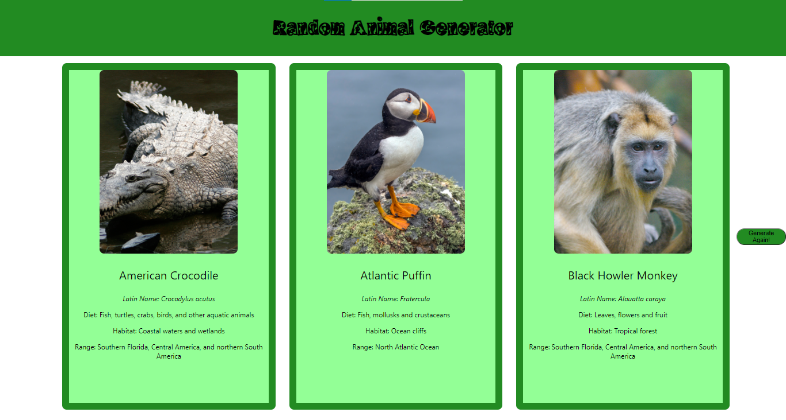

# Random Animal Generator

This project was done to practice creating webapps with React and \
using APIs. 

This project makes calls to [Zoo API](https://zoo-animal-api.herokuapp.com/)
and retrieves information and a photo \
about three random animals, and displays them in cards. 

The user can generate a set of new cards by pressing a button.

###Preview:
